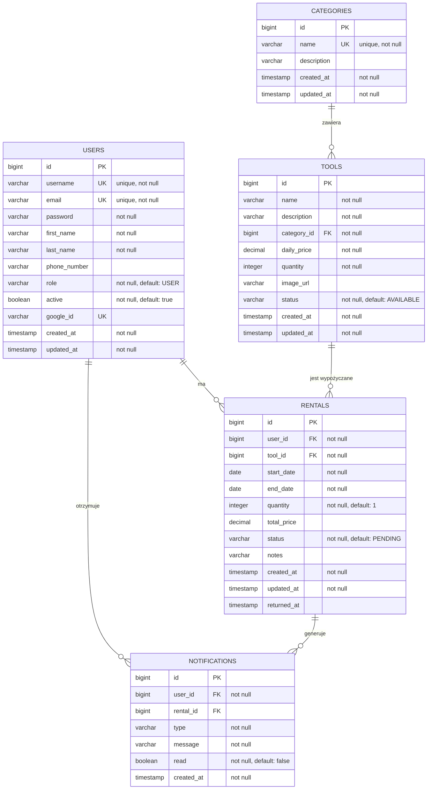

# Toolsy - Wypożyczalnia Narzędzi

Aplikacja webowa do zarządzania wypożyczalnią narzędzi z pełnym systemem autoryzacji, zarządzania użytkownikami i narzędziami.

## Technologie

### Backend

- **Java 17** - język programowania
- **Spring Boot 3.2.0** - framework aplikacyjny
- **Spring Security** - bezpieczeństwo i autoryzacja
- **JWT** - tokeny autoryzacyjne
- **Spring Data JPA** - warstwa dostępu do danych
- **H2 Database** - baza danych (możliwość przejścia na PostgreSQL)
- **Maven** - zarządzanie zależnościami

### Frontend

- **React 18** - biblioteka UI
- **React Router** - routing
- **Axios** - komunikacja z API
- **Vite** - narzędzie buildowe
- **React Toastify** - powiadomienia

## Funkcjonalności

- ✅ Rejestracja i logowanie użytkowników
- ✅ System ról (USER, ADMIN)
- ✅ Przeglądanie katalogu narzędzi
- ✅ Wyszukiwanie, filtrowanie i sortowanie narzędzi
- ✅ Wypożyczanie narzędzi
- ✅ Zarządzanie wypożyczeniami
- ✅ Panel administracyjny ze statystykami
- ✅ Zarządzanie użytkownikami
- ✅ Zarządzanie narzędziami (CRUD)
- ✅ Upload zdjęć narzędzi
- ✅ System powiadomień asynchronicznych (RabbitMQ)
- ✅ Responsywny design

## Wymagania

- Java 17 lub nowsza
- Node.js 18 lub nowsza
- Maven 3.6+
- RabbitMQ (opcjonalnie, dla powiadomień asynchronicznych)

### Instalacja RabbitMQ

**macOS:**

```bash
brew install rabbitmq
brew services start rabbitmq
```

**Linux:**

```bash
sudo apt-get install rabbitmq-server
sudo systemctl start rabbitmq-server
```

**Windows:**
Pobierz i zainstaluj z: https://www.rabbitmq.com/download.html

Aplikacja będzie działać bez RabbitMQ, ale powiadomienia asynchroniczne nie będą funkcjonować.

## Instalacja i uruchomienie

### Backend

1. Przejdź do katalogu backend:

```bash
cd backend
```

2. **Skonfiguruj zmienne środowiskowe dla Google OAuth2** (opcjonalne, ale wymagane dla logowania przez Google):

**Linux/macOS:**

```bash
export GOOGLE_CLIENT_ID="twoj-client-id-tutaj"
export GOOGLE_CLIENT_SECRET="twoj-client-secret-tutaj"
```

**Windows (PowerShell):**

```powershell
$env:GOOGLE_CLIENT_ID="twoj-client-id-tutaj"
$env:GOOGLE_CLIENT_SECRET="twoj-client-secret-tutaj"
```

**Windows (CMD):**

```cmd
set GOOGLE_CLIENT_ID=twoj-client-id-tutaj
set GOOGLE_CLIENT_SECRET=twoj-client-secret-tutaj
```

**Jak uzyskać klucze Google OAuth2:**

1. Przejdź do [Google Cloud Console](https://console.cloud.google.com/)
2. Utwórz nowy projekt lub wybierz istniejący
3. Włącz Google+ API lub Google Identity API
4. Przejdź do "Credentials" → "Create Credentials" → "OAuth 2.0 Client ID"
5. Skonfiguruj redirect URI: `http://localhost:8080/login/oauth2/code/google`
6. Skopiuj Client ID i Client Secret i ustaw jako zmienne środowiskowe

**Uwaga:** Jeśli nie skonfigurujesz zmiennych środowiskowych, logowanie przez Google nie będzie działać, ale pozostałe funkcjonalności będą działać normalnie.

3. Zainstaluj zależności i uruchom aplikację:

```bash
mvn clean install
mvn spring-boot:run
```

Backend będzie dostępny pod adresem: `http://localhost:8080`

Dokumentacja API (Swagger) dostępna pod adresem: `http://localhost:8080/swagger-ui.html`

### Frontend

1. Przejdź do katalogu frontend:

```bash
cd frontend
```

2. Zainstaluj zależności:

```bash
npm install
```

3. Uruchom aplikację w trybie deweloperskim:

```bash
npm run dev
```

Frontend będzie dostępny pod adresem: `http://localhost:3000`

## Dane testowe

Aplikacja automatycznie inicjalizuje dane testowe przy pierwszym uruchomieniu:

- **Admin**:

  - Username: `admin`
  - Password: `admin123`

- **Użytkownicy**:

  - Username: `user1` do `user10`
  - Password: `user123`

- **Narzędzia**: 30 narzędzi w różnych kategoriach
- **Wypożyczenia**: 10 przykładowych wypożyczeń

## API Endpoints

### Autoryzacja

- `POST /api/auth/login` - Logowanie
- `POST /api/auth/register` - Rejestracja

### Narzędzia

- `GET /api/tools` - Lista wszystkich narzędzi
- `GET /api/tools/available` - Lista dostępnych narzędzi
- `GET /api/tools/{id}` - Szczegóły narzędzia
- `GET /api/tools/search?q={query}` - Wyszukiwanie narzędzi
- `GET /api/tools/category/{category}` - Narzędzia po kategorii
- `POST /api/tools` - Utworzenie narzędzia (ADMIN)
- `PUT /api/tools/{id}` - Aktualizacja narzędzia (ADMIN)
- `DELETE /api/tools/{id}` - Usunięcie narzędzia (ADMIN)

### Wypożyczenia

- `POST /api/rentals` - Utworzenie wypożyczenia
- `GET /api/rentals/my` - Moje wypożyczenia
- `GET /api/rentals/{id}` - Szczegóły wypożyczenia
- `GET /api/rentals/all` - Wszystkie wypożyczenia (ADMIN)
- `PUT /api/rentals/{id}/approve` - Zatwierdzenie wypożyczenia (ADMIN)
- `PUT /api/rentals/{id}/complete` - Zakończenie wypożyczenia (ADMIN)
- `PUT /api/rentals/{id}/cancel` - Anulowanie wypożyczenia

### Użytkownicy

- `GET /api/users/me` - Aktualny użytkownik
- `GET /api/users` - Lista użytkowników (ADMIN)
- `GET /api/users/{id}` - Szczegóły użytkownika (ADMIN)
- `PUT /api/users/{id}/activate` - Aktywacja użytkownika (ADMIN)
- `PUT /api/users/{id}/deactivate` - Dezaktywacja użytkownika (ADMIN)

### Pliki

- `POST /api/files/upload` - Upload zdjęcia (ADMIN)

### Statystyki

- `GET /api/statistics` - Statystyki systemu (ADMIN)

## Struktura projektu

```
Toolsy/
├── backend/
│   ├── src/
│   │   └── main/
│   │       ├── java/com/toolsy/
│   │       │   ├── config/          # Konfiguracja
│   │       │   ├── controller/      # Kontrolery REST
│   │       │   ├── dto/             # Data Transfer Objects
│   │       │   ├── exception/       # Obsługa wyjątków
│   │       │   ├── model/           # Encje JPA
│   │       │   ├── repository/      # Repozytoria
│   │       │   ├── security/        # Konfiguracja bezpieczeństwa
│   │       │   └── service/         # Logika biznesowa
│   │       └── resources/
│   │           └── application.properties
│   └── pom.xml
├── frontend/
│   ├── src/
│   │   ├── components/              # Komponenty UI
│   │   ├── context/                 # Context API
│   │   ├── pages/                   # Strony aplikacji
│   │   ├── services/                # Serwisy API
│   │   └── App.jsx
│   ├── package.json
│   └── vite.config.js
└── README.md
```

## Architektura

Aplikacja wykorzystuje architekturę warstwową:

- **Warstwa prezentacji**: React komponenty i strony
- **Warstwa API**: REST kontrolery w Spring Boot
- **Warstwa biznesowa**: Serwisy z logiką biznesową
- **Warstwa danych**: Repozytoria JPA i encje

## Bezpieczeństwo

- Uwierzytelnianie oparte na JWT
- Autoryzacja oparta na rolach (USER, ADMIN)
- Hasła hashowane przy użyciu BCrypt
- CORS skonfigurowany dla frontendu
- Walidacja danych wejściowych

## Baza danych

Aplikacja używa H2 Database (in-memory) z automatyczną inicjalizacją danych. W pliku `application.properties` można zmienić konfigurację na PostgreSQL dla produkcji.

**Struktura bazy danych:**

- **USERS** - użytkownicy systemu (admin + 10 użytkowników testowych)
- **TOOLS** - katalog narzędzi (30 narzędzi testowych)
- **RENTALS** - wypożyczenia narzędzi (10 wypożyczeń testowych)
- **CATEGORIES** - kategorie narzędzi (5 kategorii: Elektryczne, Pneumatyczne, Ręczne, Akumulatorowe, Stacjonarne)
- **NOTIFICATIONS** - powiadomienia dla użytkowników (generowane asynchronicznie przez RabbitMQ)

Baza danych jest znormalizowana do 3NF (trzeciej postaci normalnej), co zapewnia brak redundancji danych i spójność.

## Asynchroniczność / Kolejki

Aplikacja wykorzystuje RabbitMQ do asynchronicznego przetwarzania powiadomień o wypożyczeniach. System wysyła wiadomości do kolejki przy:

- Utworzeniu wypożyczenia
- Zatwierdzeniu wypożyczenia
- Zakończeniu wypożyczenia

Konsument (`NotificationConsumer`) przetwarza wiadomości z kolejki i loguje informacje o powiadomieniach (w produkcji można rozszerzyć o wysyłanie emaili).

### Diagram ERD



**Relacje:**

- User (1) ──< Rental (Many) - Jeden użytkownik może mieć wiele wypożyczeń
- Tool (1) ──< Rental (Many) - Jedno narzędzie może być wypożyczone wiele razy
- Category (1) ──< Tool (Many) - Jedna kategoria może zawierać wiele narzędzi
- User (1) ──< Notification (Many) - Jeden użytkownik może otrzymać wiele powiadomień
- Rental (1) ──< Notification (Many) - Jedno wypożyczenie może generować wiele powiadomień

## Licencja

Projekt edukacyjny.
